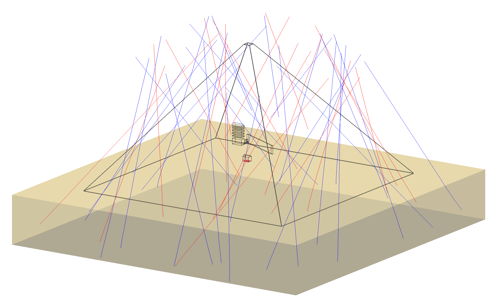

# µgraphy

Simulate the propagation of cosmic muons through large structures and reveal their internal composition. Inspired by [*Morishima et al. Nature (2017)*](https://www.nature.com/articles/nature24647).

